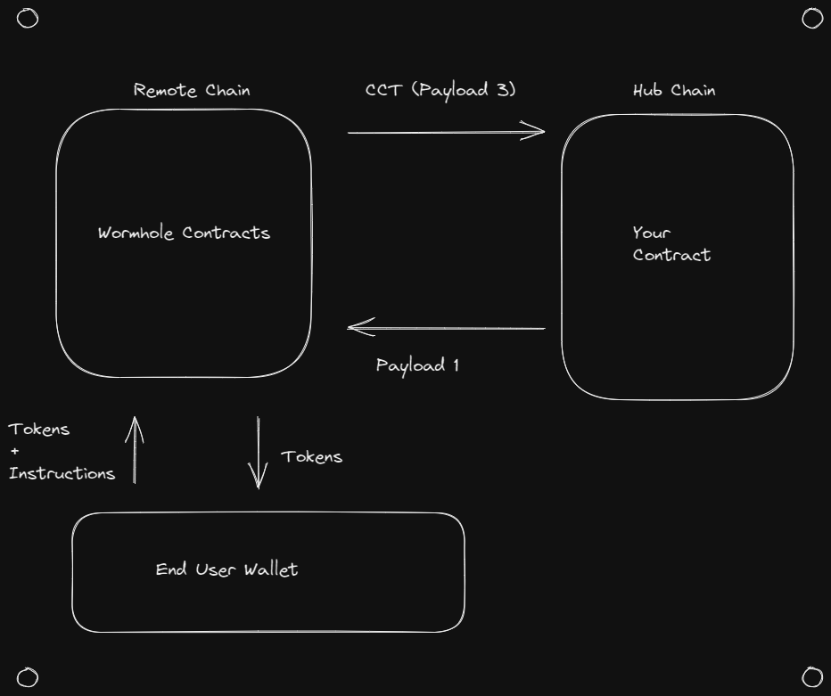

# Topology

Topology describes how data flows through your application, and the responsibilities of each component. The primary decision to be made with regard to topology is mainly where your smart contracts will live, and what responsibilities each contract holds.

## Ultra-light Clients

Ultra-light Clients are often the best option when designing an MVP for your xDapp. The defining feature of an Ultra-light Client is that you are able to support users from every chain in the Wormhole ecosystem while **only having smart contracts on a single chain (!!!)**.

This works by deploying a single _hub_ contract (or just using an existing Dapp) onto the hub chain. You then add an entrypoint which supports _contract controlled transfers_ from the xAsset contracts on the hub chain. This allows your hub contract to receive both tokens **and instructions for what to do with them** from other chains in the Wormhole ecosystem.

From there, the hub contract performs any necessary operations, and bridges any resultant tokens back to the wallet which iniated the contract controlled transfer. The only on-chain components are hub contract, and a relatively lightweight wrapper which allows the hub contract to send and receive tokens using the xAsset contracts. All other aspects of this topology are off-chain and untrusted. This pushes most of the development work out of smart contracts and into client-side typescript. This dramatically decreases smart contract risk, without altering the trust assumptions of your application.

**_Advantages:_**

- Very little added smart contract risk.
- Simple to develop.
- Easiest way to get heterogenous ecosystem support.

**_Disadvantages:_**

- Latency: Because all transactions have to bridge in and out of the hub chain, each transaction incurs the finality latency of both the remote and hub chain.
- Transaction Fees: There are always a grand total of three transactions. Two on the remote chain, and one on the hub chain.
- Use cases: There is no place to perform trusted computation on the remote chain, so some use cases are more difficult to implement (or potentially not possible).

## Hub and Spoke

Hub and Spoke models are somewhat of a natural evolution of the ultra-light client. There is still a hub contract which handles all transactions, but there is now also a contract deployed to all the remote chains.

Advantages:

- Remote contracts are lightweight and don't carry large amounts of risk.
- Can perform trusted checks on the remote chain. (Such as validating wallet balance, or any other piece of blockchain state)

Disadvantages:

- Latency (same as ultra-light clients)
- Transaction Fees
- Managing multiple contracts

## Mesh

A Mesh topology is one where each chain implements the full logic for a process, such that each contract is a peer of other contracts in the trusted network and can act autonomously.

Advantages:

- Latency: Users can often perform their operation without waiting for other chains.
- Transaction Fees: Does not stack the transaction fees of multiple chains.

Disadvantages:

- Complexity: there are now quite a few contracts to manage, especially if they are implemented multiple times across different VMs.
- Data desync: because each blockchain acts independently, each chain will have independent state. This can open up unwanted arbitrage opportunities and other discrepancies.
- Race conditions: In cases where an event is supposed to propagate through the entire system at a fixed time (for example, when closing a governance vote), it can be difficult to synchronize all the blockchains.

## Distributed

A distributed topology is one where different blockchains have different responsibilities.

Advantages:

- Power: utilize each blockchain for whatever is most optimal.

Disadvantages:

- Complexity: requires multiple specialized smart contracts, and potentially additional on-chain processes.

## Mix & Match

Different use cases have different optimal topologies, and it's possible to use different topologies for different workflows in your application. This means you should not feel 'locked in' to a single topology, and should instead consider designing each workflow independently. For example, governance workflows are generally best implemented using a Hub and Spoke topology, even if the rest of the application uses a Mesh architecture. As such, your contracts will likely evolve over time as your xDapp evolves and adds additional workflows.

You can also progress through different topologies. A common strategy is to start off with an ultra-light client, move to a hub and spoke configuration, and then add optimizations and specialties to contracts as the need arises.
