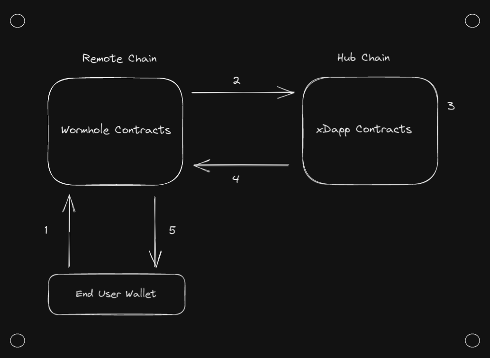
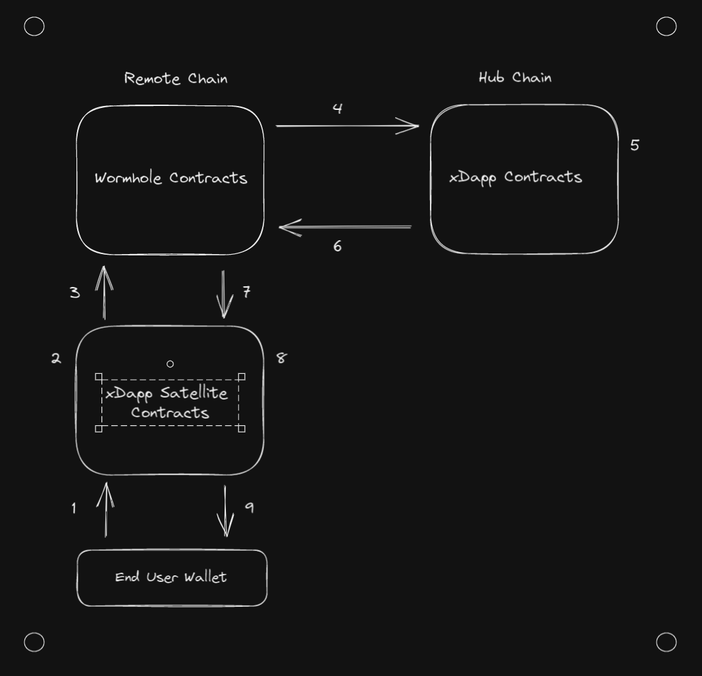
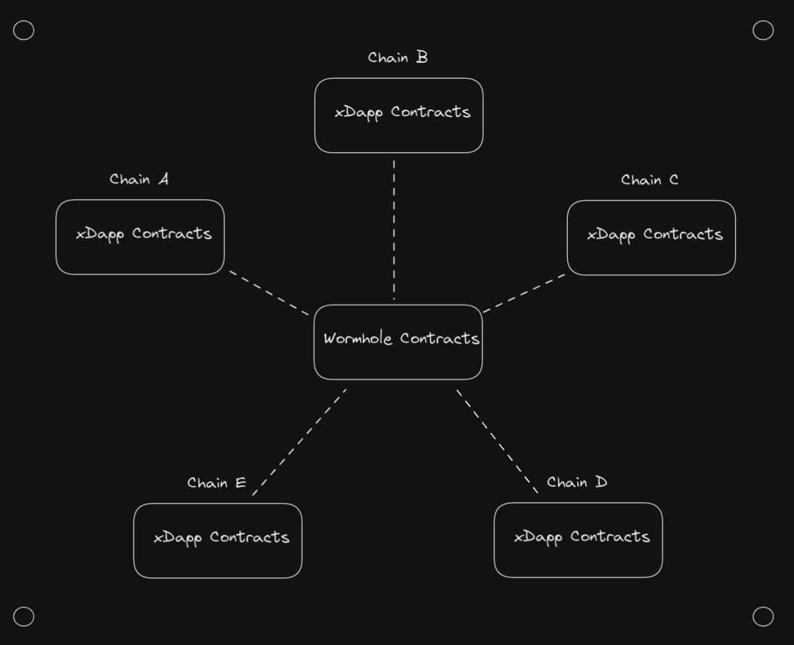
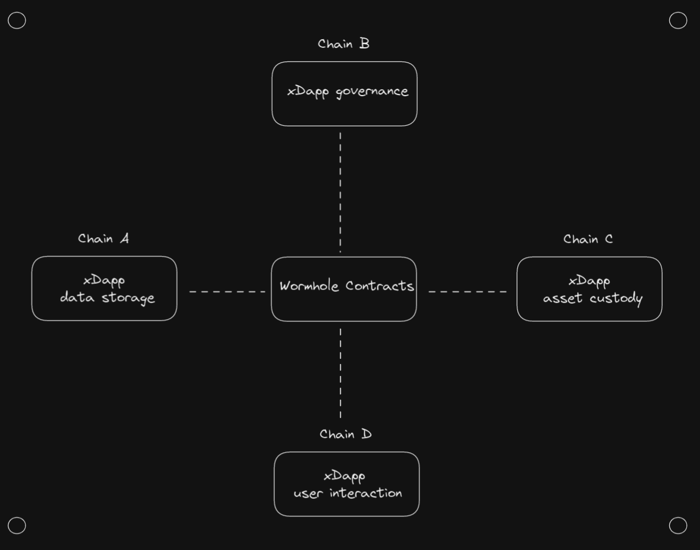

# Topology

Topology describes how data flows through your application and defines the responsibilities of each component. In terms of overall xDapp topology, the primary decision is determining where your smart contracts will live and the responsibilities each contract will hold.

## Ultra-light Clients

Ultra-light Clients are often the best option when designing an MVP for your xDapp. The defining feature of an Ultra-light Client is that you are able to support users from every chain in the Wormhole ecosystem while **only having smart contracts on a single chain (!!!)**.

xDapps with this structure work by having a hub chain that all application contract logic is deployed to and entrypoints which receive and send Wormhole messages to remote chains. The network of Wormhole contracts deployed on other chains across the ecosystem provide the rest of the heavy lifting to send messages across chains.

You can think of the data flow across a xDapp with a Ultra-light Client as follows:

1. The end user's wallet interacts with Wormhole contracts on remote chain.
2. The Wormhole contracts on remote chain generate a VAA which is received by your xDapp contract on the hub chain.
3. Your xDapp contract on the hub chain performs all necessary operations.
4. Your xDapp contract interacts with Wormhole contracts on the hub chain.
5. The Wormhole contracts on hub chain generate a VAA which is sent back to the end user's wallet on the remote chain.

**_Advantages:_**

- Very little added smart contract risk.
- Simple to develop.
- Easiest way to get heterogeneous ecosystem support.

**_Disadvantages:_**

- Latency: Transactions incur latencies associated with bridging into and out of both the remote and hub chain.
- Transaction Fees: There are always a grand total of three transactions. Two on the remote chain, and one on the hub chain.
- Use cases: There is no place to perform trusted computation on the remote chain, so some use cases are more difficult to implement (or potentially not possible).

## Hub-and-Spoke

Hub and Spoke models can somewhat be thought of as the natural evolution of the ultra-light client. There is still a hub contract which handles all transactions, but there is now also a contract deployed to all the remote chains that is capable of performing some trusted computation.

You can think of the data flow across a Hub-and-Spoke system as follows:

1. The end user's wallet interacts with your (lightweight) remote contracts.
2. The remote contracts perform any necessary trusted computation.
3. The remote contracts use Wormhole to generate a VAA, which is consumed by the hub contract.
4. The hub contract performs all necessary operations.
5. The hub contract uses Wormhole to send a message back to the original remote contract.
6. The remote contract takes whatever action is needed to finish the process.

**_Advantages:_**

- Remote contracts are lightweight and don't carry large amounts of risk.
- Can perform trusted checks on the remote chain. (Such as validating wallet balance, or any other piece of blockchain state)

**_Disadvantages:_**

- Latency (same as ultra-light clients)
- Transaction Fees
- Managing multiple contracts

## Mesh

Mesh topologies can somewhat be thought of as the next evolution of the Hub and Spoke model. There are now contracts capable of handling all transactions for an application are deployed on all supported chains. Each contract can be thought of as a peer of other contracts in the trusted network and can act autonomously.

This is historically the most popular methodology for going cross-chain. It's very attractive in ecosystems like EVM or Cosmos, where a single smart contract can simply be deployed across many different blockchains.

**_Advantages:_**

- Latency: Users can often perform their operation without waiting for other chains.
- Transaction Fees: Does not stack the transaction fees of multiple chains.

**_Disadvantages:_**

- Complexity: there are now quite a few contracts to manage, especially if they are implemented multiple times across different VMs.
- Data desynchronization: because each blockchain acts independently, each chain will have independent state. This can open up unwanted arbitrage opportunities and other discrepancies.
- Race conditions: In cases where an event is supposed to propagate through the entire system at a fixed time (for example, when closing a governance vote), it can be difficult to synchronize all the blockchains.

## Distributed

Distributed topologies can somewhat be thought of as the next evolution of the Mesh model. Instead of contracts that are capable of handling all transactions for an application on all supported chain, applications are broken up into separate responsibilities (i.e. data storage, user interaction, asset custody, governance) and deployed to different blockchains.

Advantages:

- Power: utilize each blockchain for whatever is most optimal.

Disadvantages:

- Complexity: requires multiple specialized smart contracts, and potentially additional on-chain processes.

## Mix & Match

Different use cases have different optimal topologies, and it's possible to use different topologies for different workflows in your application. This means you should not feel 'locked in' to a single topology, and should instead consider designing each workflow independently. For example, governance workflows are generally best implemented using a Hub and Spoke topology, even if the rest of the application uses a Mesh architecture. As such, your contracts will likely evolve over time as your xDapp evolves and adds additional workflows.

You can also progress through different topologies. A common strategy is to start off with an ultra-light client, move to a hub and spoke configuration, and then add optimizations and specialties to contracts as the need arises.
