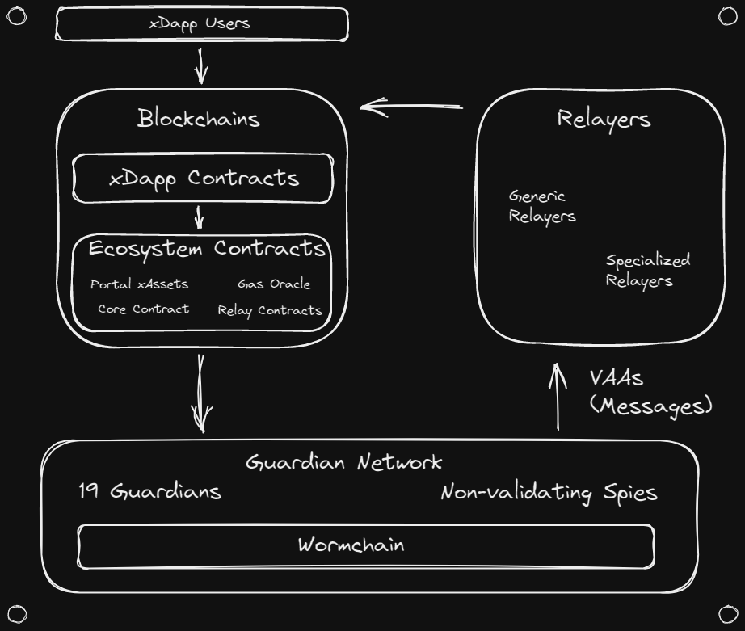

# Architecture Overview

Wormhole is a fairly complex ecosystem, with several noteworthy components. Before we go in depth into each component, let's take a moment to lay out the names of the major pieces, and how they fit together.

### On-Chain Components

- **xDapp Contracts** - these are contracts developed by xDapp developers. They receive transactions from the end user, and then interact with other xDapp contracts and Wormhole Ecosystem Contracts in order to provide their service.
- **Ecosystem Contracts** - these are contracts inside the Wormhole Ecosystem, subject to Wormhole governance. Their job is to provide the feature suite of Wormhole to xDapp developers.

  - **Core Contracts** - these are the primary ecosystem contracts. These are the contracts which the Guardians observe, and which fundamentally allow for cross-chain communication.
  - **Portal xAsset Contracts** - these contracts allow normal tokens to be converted to xAssets, and enable these xAssets to be bridged around the ecosystem.
  - **Relay Contracts** - _in development\*_ - allow xDapps to send messages to a specific blockchain, via the use of the decentralized Generic Relayer network.
  - **Gas Oracle** - _in development\*_ - oracle for recommended fair gas prices across the ecosystem.

### Off-Chain Components

- **Guardian Network** - Guardians exist in their own p2p network. They observe the Core Contract on each supported chain, and produce VAAs (signed messages) when those contracts receive an interaction.

  - **Guardian** - One of the validators in the Guardian Network which contributes to the VAA multisig. There are currently exactly 19 Guardians.

  - **Spy** - Validators on the Guardian Network which are not part of the Guardian set. These spies can observe and forward network traffic, which helps scale up VAA distribution.

  - **Wormchain** - _in development\*_ - a purpose built cosmos blockchain which aids the Guardian Network, and allows for formal interaction with the Guardians.

- **Specialized Relayers** - relayers which only handle VAAs for a specific protocol or xDapp. This allows them to execute custom logic off-chain, which can reduce gas costs and increase cross-chain compatibility. Currently, xDapp developers are responsible for developing and hosting this component.

- **Generic Relayers** - _in development\*_ - a decentralized relayer network which delivers messages that are requested on-chain via the Wormhole Relay Contract.

- **VAAs** - Verifiable Action Approvals - These are the key piece of data in the Wormhole ecosystem. They contain the messages which are emitted by xDapps, along with information such as what contract emitted the message. The VAAs are signed by the Guardians, and need 13/19 signatures in order to be considered authentic.

\*\*Features listed as _in development_ are not yet available in mainnet.
