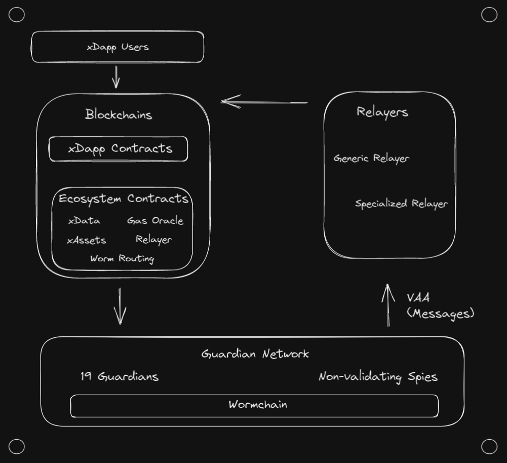

# Architecture Overview

Wormhole is a complex ecosystem with several noteworthy components. Before we go into each component in depth, let's talk about the names of the major pieces and how they fit together.

### On-Chain Components

- **xDapp Contracts** - Contracts developed by xDapp developers. They receive transactions from the end user and then interact with other xDapp contracts and Wormhole Ecosystem Contracts in order to provide their service.

- **Ecosystem Contracts** - Contracts subject to Wormhole governance which live inside the Wormhole Ecosystem. Their job is to provide the feature suite of Wormhole to xDapp developers.

  - **Core Contracts** - Primary ecosystem contracts. These are the contracts which the Guardians observe and which fundamentally allow for cross-chain communication.

  - **xAsset Contracts** - Contracts that allow normal tokens to be converted to xAssets and enable these xAssets to be bridged.

  - **Relay Contracts** - _in development\*_ - Contracts that allow xDapps to send messages to a specific blockchain via the decentralized Generic Relayer network.

  - **Gas Oracle** - _in development\*_ - Oracle for recommended fair gas prices across the ecosystem.

  - **Worm Router Contracts** - _in development\*_ - Contracts that allow developers to make their Dapp an xDapp that users on any Wormhole supported chain can interac with purely through clientside code.

### Off-Chain Components

- **Guardian Network** - Validators that exist in their own p2p network. Guardians observe the Core Contract on each supported chain and produce VAAs (signed messages) when those contracts receive an interaction.

- **Guardian** - One of 19 validators in the Guardian Network that contributes to the VAA multisig.

- **Spy** - Validators on the Guardian Network which are not part of the Guardian set. A spy can observe and forward network traffic, which helps scale up VAA distribution.

- **VAAs** - Verifiable Action Approvals (VAAs) are the key piece of data in the Wormhole ecosystem, containing the messages emitted by xDapps along with information such as what contract emitted the message. The VAAs are signed by the Guardians and need 13/19 signatures to be considered authentic.

- **Specialized Relayers** - Relayers that only handle VAAs for a specific protocol or xDapp. They can execute custom logic off-chain, which can reduce gas costs and increase cross-chain compatibility. Currently, xDapp developers are responsible for developing and hosting specialized relayers.

- **Generic Relayers** - _in development\*_ - A decentralized relayer network which delivers messages that are requested on-chain via the Wormhole Relay Contract.

- **Wormchain** - _in development\*_ - A purpose-built cosmos blockchain which aids the Guardian Network and allows for formal interaction with the Guardians.

\*Features listed as _in development_ are not yet available.

---

In the next section, we'll give an overview of how the Wormhole Guardian network creates VAAs along with a look at the key design considerations that underpin the network.
